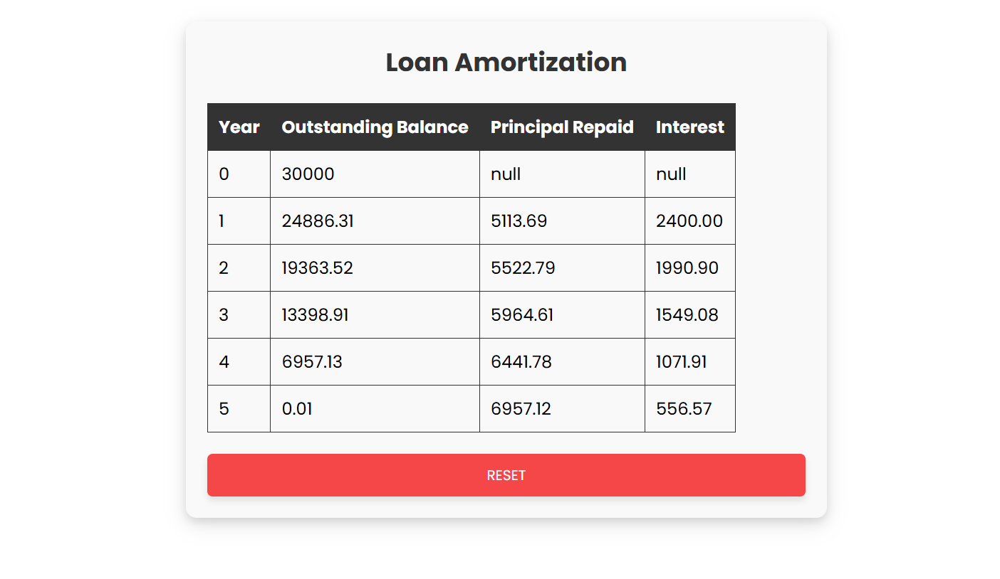

# Finance Geek Assistant

Finance Geek Assistant is a web application that helps users calculate loan amortization schedules. It provides a user-friendly interface to input loan details and displays the amortization schedule in a table format.

## Features

- Input fields for loan amount, interest rate, and loan term
- Validation for required input fields
- Display of error messages with icons for missing inputs
- Calculation of loan amortization schedule
- Display of amortization schedule in a responsive table
- Reset button to clear the form and table

## Technologies Used

- HTML
- CSS
- JavaScript

## Getting Started

### Prerequisites

- A web browser

### Installation

1. Clone the repository:
    ```sh
    git clone https://github.com/devjamesnjoroge/finance-geek.git
    ```
2. Navigate to the project directory:
    ```sh
    cd finance-geek
    ```
3. Open `index.html` in your web browser.

## Usage

1. Enter the loan amount, interest rate, and loan term in the respective input fields.
2. Click the "Calculate" button to generate the amortization schedule.
3. If any input fields are missing, error messages will be displayed with an exclamation icon.
4. The amortization schedule will be displayed in a table format.
5. Click the "RESET" button to clear the form and table.

## Project Structure

- `index.html`: The main HTML file containing the structure of the web application.
- `styles.css`: The CSS file containing styles for the web application.
- `main.js`: The JavaScript file containing the logic for form validation, calculation, and table display.

## Screenshots



## License

This project is licensed under the MIT License. See the [LICENSE](LICENSE) file for details.

## Acknowledgements

- Icons from [Bootstrap Icons](https://icons.getbootstrap.com/)
- Inspired by various finance and loan calculators available online.
